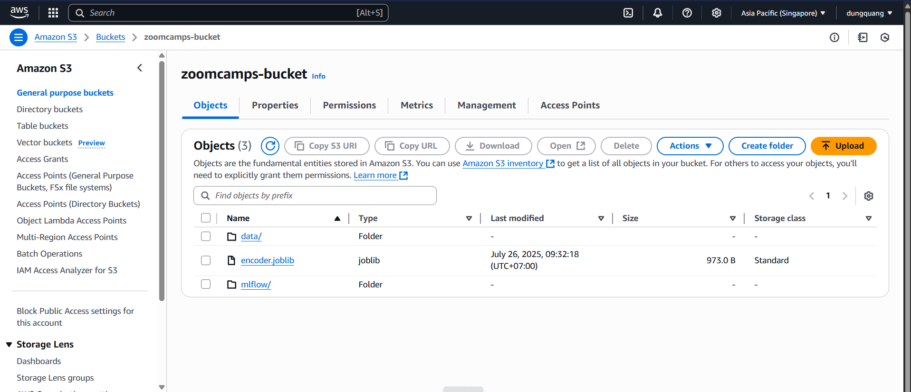
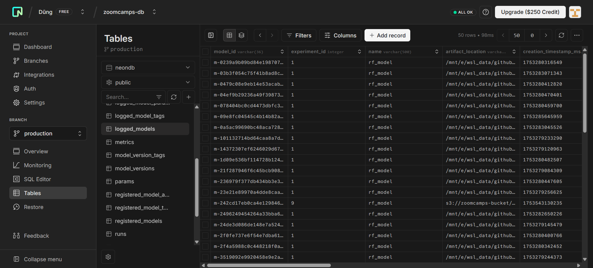
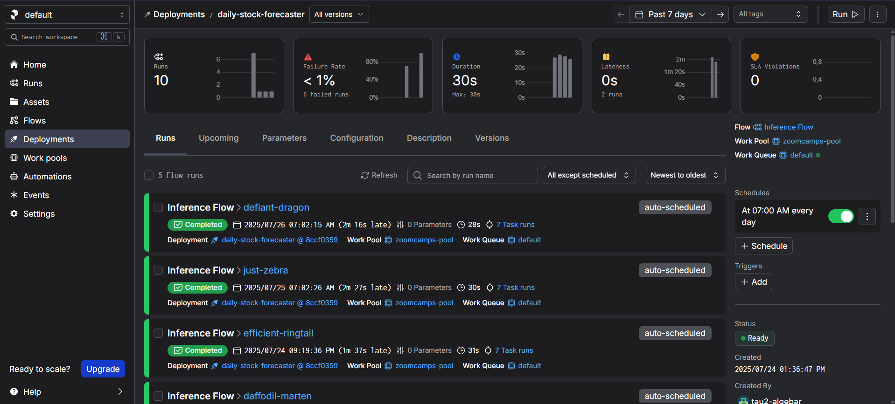
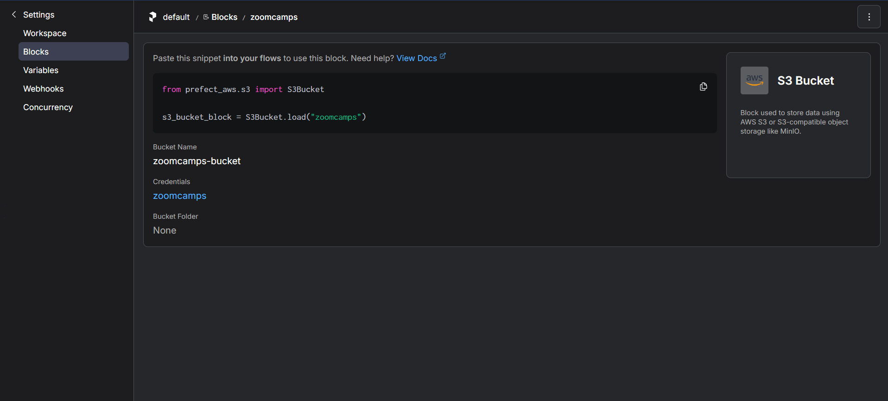
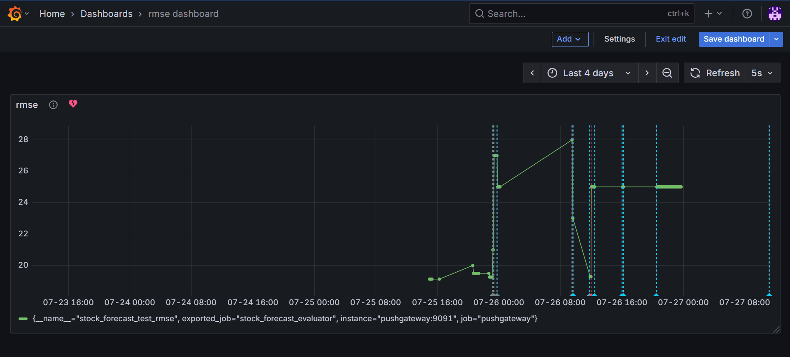
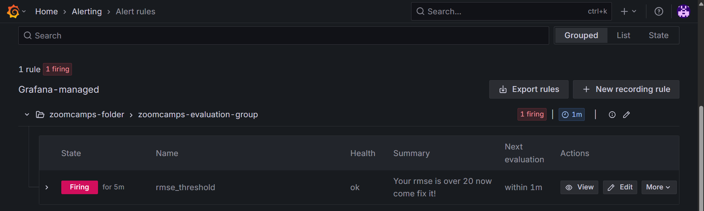

# Stock Forecasting Project

## 🚀 Problem Description

In financial markets, predicting stock price trends is a valuable yet challenging task due to high volatility and noise. This project aims to build an end-to-end machine learning pipeline to forecast stock prices using historical data. The goal is to automate the forecasting process, from data ingestion to model training, registration, deployment, and monitoring, following modern MLOps practices. The project focuses on simplicity in modeling (using Random Forest Regressor) to highlight the MLOps lifecycle rather than complex model performance.

---

## For reviewer
You may not be able to run most thing locally due to the need for API keys (e.g., AWS, Prefect, Neon). However I include clear screenshots and logs to help you evaluate all components.

---

## ☁️ Cloud Infrastructure

* S3 bucket to store both data and model artifacts.

* MLflow backend is hosted on ) (a remote PostgreSQL database).

*  manages deployment and flow scheduling.

---

🚂 Full Pipeline Overview

*Use `make help` to view available `make` command*

*You need to `make setup` to create and install neccessary dependencies first*

* prepare: Fetch stock data since Jan 1st, split train/test (last 30 days), store raw/processed data in S3
→ Run: `make prepare`

* train: Load processed data from S3, create MLflow experiment, train and tune model with Optuna, track with MLflow, save artifacts to S3
→ Run: `make train`

* register: Register best model from latest experiment to MLflow
→ Run: `make register`

* inference: Daily forecast using latest registered model, deployed via Prefect Cloud; predictions saved to S3
→ Run: `make inference`

* evaluation: Manual task to evaluate current model, push RMSE to Prometheus/Grafana for monitoring and alerts
→ Run: `make evaluate`

---

## 🎯 Experiment Tracking and Model Registry

* **MLflow** is used for:

  * **Tracking experiments**: Log RMSE metrics, parameters, and versions.
  * **Model registry**: The best-performing model can be registered and versioned.

* MLflow uses Neon.tech as the remote backend and S3 bucket for artifacts storage.


* To start MLflow UI:
```bash
mlflow server \
  --backend-store-uri=postgresql://<user>:<pass>@<neon_host>:<port>/<dbname> \
  --default-artifact-root=s3://<bucket>/mlflow/
```

---

## 🔁 Workflow Orchestration

* **Prefect 2.0** is used as the orchestration tool.
* The flows include multiple prefect task and materialize (prefect assets).

  * Data preparation
  * Model training
  * Model registration
  * Daily inference
  * Model evaluation (for monitoring)

* The inference flow is deployed via `prefect.yaml`

---

## 📦 Model Deployment

* The trained model is registered with MLflow, but not deployed as a container or REST API.
* Instead, model inference is performed by a Prefect deployment, scheduled to run daily.
* This automated flow pulls the latest model from the MLflow registry and generates forecasts for the upcoming day.

* All secrets and environment variables (e.g., AWS credentials) are managed through Prefect job variables


---

## 📈 Model Monitoring

* RMSE on test data is computed and pushed to Prometheus Pushgateway.
* Grafana dashboards are set up to visualize metrics, hosted via Docker Compose.

* To run locally:
```bash
cd monitor
docker compose pull
docker compose up
```
* Then send the latest RMSE to Prometheus using:
```bash
make evaluate
```
Visit dashboard at `localhost:3000`
* Monitoring logic checks if RMSE exceeds a threshold → send an alert to dashboard.


---

## 📦 Reproducibility

* The entire pipeline can be reproduced using:

  * A clear `Makefile`
  * `requirements.txt`
  * Python scripts organized in a `src/` directory

---

## ✅ Best Practices

* ✅ **Unit tests** with `pytest`  
  → Run: `make test`
* ✅ **Makefile** to automate common tasks like training, inference, and cleaning  
  → Run `make help` to see all available commands
* ✅ **Code formatting & linting** using `black` and `flake8`  
  → Run: `make format`
* ⚠️ **Pre-commit hooks**: Not yet implemented
* ⚠️ **Integration test**: Not yet implemented
* ⚠️ **CI/CD pipeline**: Not yet implemented

---

## 🛠 Project Structure

```
stock_forecast
├── Makefile                  # Automation for common tasks: prepare, train, register, predict, format, test, clean
├── README.md                 # Project documentation and setup instructions
├── logs
│   └── app.log               # Logs generated during pipeline execution
├── monitor                   # Monitoring setup using Prometheus and Grafana
│   ├── docker-compose.yml    # Spins up Prometheus and Grafana via Docker
│   ├── grafana
│   │   ├── dashboards        # RMSE visualization dashboard JSON
│   │   └── grafana.ini       # Grafana configuration file
│   └── prometheus
│       └── prometheus.yml    # Prometheus scraping config for collecting metrics
├── notebooks
│   └── sandbox.ipynb         # (Can be ignored) just for experimentation
├── prefect.yaml              # Prefect deployment config for running inference flow
├── registered_model          # Directory containing the registered MLflow model loaded locally from mlflow
├── requirements.txt          # List of Python dependencies
├── screenshots               # Screenshots for README
├── src
│   ├── data_preparation.py   # Script for feature engineering and data preprocessing
│   ├── inference.py          # Inference flow to predict stock prices, integrated with Prefect
│   ├── models
│   │   ├── evaluate.py       # Evaluation script that pushes RMSE to Prometheus
│   │   ├── register.py       # Registers the best-performing model to MLflow
│   │   └── train.py          # Model training pipeline
│   └── utils
│       ├── logger.py         # Logging configuration
│       ├── mlflow.py         # MLflow helper functions for logging and tracking
│       ├── objective.py      # Custom objective for optuna optimization
│       └── s3_io.py          # Utilities for reading/writing to S3
└── test                      # Unit tests for core pipeline components
    ├── test_data.py          # Tests for data preprocessing
    ├── test_train.py         # Tests for model training
```